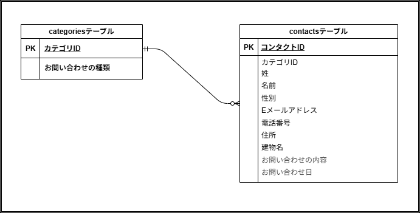

# アプリケーション名
お問い合わせフォーム

## 環境構築

Dockerビルド
1. git clone \*\*\*
2. docker-compose up -d -build

※MySQLは、OSによって起動しない場合があるのでそれぞれのPCに合わせて docker-compose.ymlファイルを編集してください。

Laravel環境構築
1. docker-compose exec php bash
2. compoiser install
3. .env.exampleファイルから.envを作成し、環境変数を変更
    変更項目、値  
     DB_HOST=mysql
     DB_DATABASE=laravel_db
     DB_USERNAME=laravel_user
     DB_PASSWORD=laravel_pass
4. Fortifyの導入
    composer require laravel/fortify
    php artisan vendor:publish --provider="Laravel\Fortify\FortifyServiceProvider"
5. php artisan key:generate
6. php artisan migrate
7. php atrisan db:seed

## 使用技術(実行環境)
・PHP 8.1 
・Laravel 8.83 
・MySQL:8.0 

## ER図

## URL
・開発環境：http://localhost/ 
・phpMyAdmin：http://localhost:8080/
